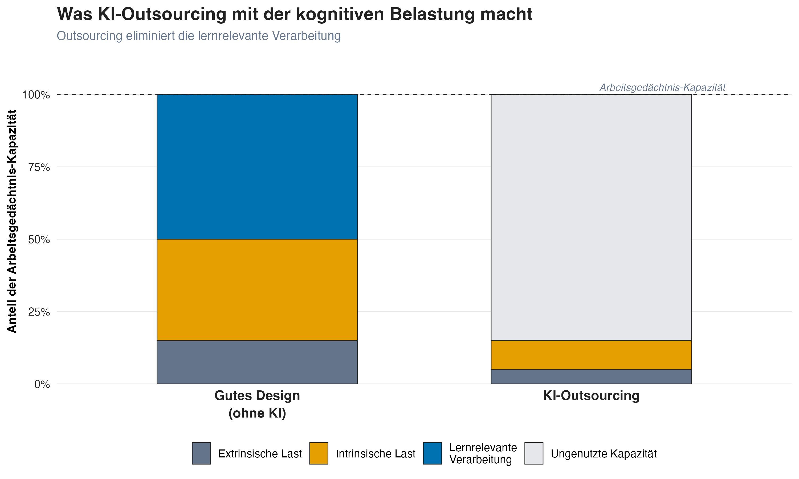

## Was wir bisher wissen {.center}

Lernen = Schemabildung im Langzeitgedächtnis

Erfordert aktive kognitive Verarbeitung

Fühlt sich anstrengend an (metakognitive Falle)

Ziel: **Transfer**, also Wissen auf neue Situationen anwenden können

:::{.fragment}
### Jetzt: Was macht KI mit diesen Prozessen?
:::

## Offloading vs. Outsourcing

Die entscheidende Unterscheidung

::::{.columns}
:::{.column width="50%"}
### Cognitive Offloading

Tool reduziert Arbeitsgedächtnis-Last, während die Person denkt

*Beispiel:* Taschenrechner bei Problemlösung

Lernrelevante Verarbeitung: **erhalten**
:::

:::{.column width="50%"}
:::{.fragment}
### Cognitive Outsourcing

Tool übernimmt das Denken

*Beispiel:* KI schreibt den Aufsatz

Lernrelevante Verarbeitung: **eliminiert**
:::
:::
::::

:::{.fragment}
::: {.callout-warning}
Die Frage ist nicht *"Dürfen Studierende KI nutzen?"*, sondern: **Wird das Denken ausgelagert oder nur unterstützt?**
:::
:::

## Das Offloading-Outsourcing-Spektrum



## CLT und KI {.smaller}

::::{.columns}
:::{.column width="50%"}

:::

:::{.column width="50%"}
KI optimiert für **Produktion** statt Lernen: Die Komplexität des Materials bleibt gleich, aber die Studierenden begegnen ihr nie.

:::{.fragment}
Lernrelevante Verarbeitung wird nur eliminiert, wenn KI die Denkarbeit **übernimmt** (Outsourcing).
:::

:::{.fragment}
Wenn KI *nach eigenem Versuch* als Feedback-Werkzeug dient (Offloading), kann die lernrelevante Verarbeitung **erhalten bleiben**.
:::

:::{.fragment}
Die Reihenfolge entscheidet: **Versuch → dann → KI-Feedback**
:::
:::
::::

## Aber können Studierende nicht einfach prüfen, was die KI liefert? {.center}

. . .

Machen wir den Test.

## Finde den Fehler {.smaller}

Der folgende Absatz enthält **einen sachlich falschen Satz.** Welcher?

> Der p-Wert ist eines der meistverwendeten und meistmissverstandenen Konzepte der empirischen Forschung. Er gibt die Wahrscheinlichkeit an, die beobachteten Daten (oder extremere) zu erhalten, unter der Annahme, dass die Nullhypothese zutrifft. Ein häufig übersehenes Problem: Statistische Signifikanz hängt stark von der Stichprobengrösse ab. Mit genügend grossen Stichproben wird praktisch jeder noch so kleine Effekt signifikant. Umgekehrt gilt: Je kleiner die Stichprobe, desto grösser muss der beobachtete Effekt sein, um Signifikanz zu erreichen, weshalb kleine Studien die tatsächliche Effektgrösse tendenziell unterschätzen.

:::{.fragment}
 **Schwierig?** Genau das ist der Punkt.
:::

## Der Fehler {.smaller}

> "[...] weshalb kleine Studien die tatsächliche Effektgrösse tendenziell **unterschätzen**."

Das Gegenteil ist richtig: Kleine Studien, die signifikante Ergebnisse liefern, **überschätzen** die Effektgrösse systematisch. Nur ungewöhnlich grosse beobachtete Effekte schaffen es in kleinen Stichproben über die Signifikanzschwelle, daher sind die publizierten Effekte inflationiert [*Winner's Curse*; @buttonPowerFailureWhy2013].

:::{.fragment}
### Warum du ihn wahrscheinlich nicht gefunden hast

Dir fehlen die **Schemata** in quantitativer Methodenlehre. Alles klingt plausibel und fachlich korrekt, aber ohne eigene Kriterien kannst du Richtiges nicht von Falschem unterscheiden.

**So geht es deinen Studierenden mit KI-generierten Texten in ihrem Fach.**
:::

## Das Evaluationsparadox {.smaller}

> *"Studierende müssen lernen, KI-Outputs kritisch zu bewerten."*

Um KI-Outputs beurteilen zu können, braucht man genau die **Fachkompetenz**, die das Lernen erst entwickeln soll.

:::{.fragment}

| | Expert:innen | Anfänger:innen |
|---|---|---|
| **Bewertungskriterien** | Unabhängig vorhanden | Fehlen |
| **KI-Fehler** | Sofort erkennbar | Nicht erkennbar |
| **"Kritische Nutzung"** | Echte Evaluation | Oberflächliches Prüfen |

:::

:::{.fragment}
::: {.callout-important}
### Kompetente Nutzung setzt Kompetenz voraus
Expert:innen können KI als Verstärker nutzen. Anfänger:innen riskieren dauerhafte Abhängigkeit. Das trifft Studierende mit schwachem Vorwissen überproportional [@cuiEffectsGenerativeAI2024].
:::
:::

<!-- ## Das Evaluationsparadox: Der Kreislauf

 -->

## Lernen ≠ Leisten {.smaller}

Studierende können mit KI korrekte Ergebnisse *produzieren* (leisten), ohne etwas *gelernt* zu haben [@bjorkMemoryMetamemoryConsiderations1994]. Die Folge: **Schein-Kompetenz**. Texte, die fachlich korrekt aussehen, aber ohne eigene kognitive Arbeit entstanden sind.

:::{.fragment}
Das sichtbare Problem ist akademische Integrität. 

Das eigentliche Problem liegt tiefer: Ohne eigene Verarbeitung entstehen keine Schemata. Ohne Schemata kein Transfer. Wenn Studierende später in neuen Situationen auf sich gestellt sind, fehlen ihnen die **internen Ressourcen**.
:::

 

:::{.fragment}
::: {.callout-warning}
### Das Kernproblem ist nicht Plagiat
Das Kernproblem ist, dass Studierende **kompetent aussehen können, ohne kompetent zu sein**. Die Lücke wird erst sichtbar, wenn die KI nicht mehr verfügbar ist.
:::
:::

::: {.notes}
Dieser Punkt ist zentral und wird von Lehrenden oft übersehen, weil die Plagiatsdiskussion so dominant ist. Wenn wir KI-Nutzung nur als Integritätsproblem framen ("Studierende schummeln"), dann behandeln wir das Symptom, nicht die Ursache.

Der eigentliche Schaden: Studierende täuschen nicht nur uns, sie täuschen sich selbst. Sie erleben sich als kompetent, weil sie gute Ergebnisse abliefern. Aber die Wissensstrukturen, die sie bräuchten, um in neuen Situationen eigenständig zu handeln, wurden nie aufgebaut. Das ist tückischer als klassisches Plagiat, weil Plagiat bewusst geschieht. Hier merken Studierende oft gar nicht, dass sie nichts gelernt haben.

Praktisch: Wenn ihr in eurer Lehre über KI-Policy nachdenkt, verschiebt den Fokus von "Wie erwischen wir Betrügende?" zu "Wie stellen wir sicher, dass die kognitive Arbeit bei den Studierenden bleibt?"
:::

## Wie gestalten wir Aufgaben, die das Lernen schützen? {.center}

. . .

### 5 Leitfragen für die Aufgabenanalyse

## Leitfrage 1

### Geht es primär ums Lernen?

::::{.columns}
:::{.column width="50%"}
[**Nein**]{style="color: #0072B2; font-size: 1.2em;"}

:::{.fragment}
Die Aufgabe dient der Produktion, nicht dem Kompetenzaufbau. KI-Unterstützung kann sinnvoll sein.
:::
:::

:::{.column width="50%"}
[**Ja**]{style="color: #D55E00; font-size: 1.2em;"}

:::{.fragment}
Die kognitive Arbeit muss geschützt werden. Nächster Schritt: herausfinden, *welche* Denkarbeit die Aufgabe verlangt.
:::
:::
::::

## Leitfrage 2 {.smaller}

### Welche Denkarbeit verlangt die Aufgabe?

| Operation | Was Studierende tun | Wozu es dient |
|-----------|-------------------|---------------|
| **Abrufen** | Wissen aus dem Gedächtnis aktivieren | Festigt Schemata (Retrieval Practice) |
| **Generieren** | Eigenen Versuch produzieren | Baut neue Verbindungen auf (Generation Effect) |
| **Verknüpfen** | Vergleichen, einordnen, integrieren | Erweitert und vernetzt Schemata |
| **Überwachen** | Eigene Arbeit prüfen, Fehler erkennen | Stärkt metakognitive Kontrolle |

:::{.fragment}
Diese Operationen *sind* das Lernen. Was davon wegfällt, fehlt im Kopf der Studierenden.
:::

::: {.notes}
Das ist der Kern der Analyse. Welche dieser vier Operationen verlangt eure Aufgabe? Die meisten Aufgaben erfordern mehrere davon. Die Frage ist: welche davon sind die, die das Lernen tragen? Das sind die Operationen, die ihr vor KI-Outsourcing schützen müsst.

Beispiel Fallstudie Pflege: Studierende müssen Symptome abrufen, eine Differentialdiagnose generieren, Befunde verknüpfen, und ihr Urteil überwachen. Alle vier Operationen sind lernrelevant. Wenn KI die Diagnose liefert, werden Generieren und Verknüpfen eliminiert.
:::

## Leitfrage 3

### Welche dieser Operationen würde KI übernehmen?

Nicht die ganze Aufgabe, sondern: Welche *spezifische Denkarbeit* fällt weg, wenn Studierende KI einsetzen?

:::{.fragment}
::: {.callout-warning}
Manchmal übernimmt KI nur einen Teil der Aufgabe. Oft ist genau dieser Teil der lernrelevante.
:::
:::

::: {.notes}
Frage 3 macht die Analyse konkret. Nicht "Kann KI die Aufgabe?" sondern "Welche der vier Operationen übernimmt KI?" Das ist ein wichtiger Unterschied: Manchmal kann KI eine Aufgabe teilweise übernehmen, und der Teil, den sie übernimmt, ist genau der lernrelevante.
:::

## Leitfrage 4

### Werden noch Grundlagen aufgebaut?

::::{.columns}
:::{.column width="50%"}
[**Ja**]{style="color: #D55E00; font-size: 1.2em;"}

:::{.fragment}
Studierende bauen noch Grundwissen auf. Die identifizierten Operationen müssen bei ihnen bleiben.
:::
:::

:::{.column width="50%"}
[**Nein**]{style="color: #0072B2; font-size: 1.2em;"}

:::{.fragment}
Studierende haben bereits Schemata aufgebaut. Sie können KI-Output einordnen und gezielt nutzen, weil sie eigene Kriterien haben.
:::
:::
::::

::: {.notes}
Frage 4 moduliert die Strenge: Wenn Studierende schon Expertise haben, können sie KI als Verstärker nutzen. Wenn sie noch Grundlagen aufbauen, müssen die Kernoperationen geschützt werden.
:::

## Leitfrage 5

### Arbeiten Studierende zuerst selbst, bevor KI ins Spiel kommt?

::::{.columns}
:::{.column width="50%"}
[**Ja**]{style="color: #0072B2; font-size: 1.2em;"}

:::{.fragment}
Studierende durchlaufen die Kernoperationen zuerst selbst, KI kommt danach. Die Reihenfolge ist bereits richtig.
:::
:::

:::{.column width="50%"}
[**Nein**]{style="color: #D55E00; font-size: 1.2em;"}

:::{.fragment}
Ohne eigenen Versuch gibt es nichts, woran KI-Feedback ansetzen kann. Reihenfolge einbauen: erst Versuch, dann KI.
:::
:::
::::

::: {.notes}
Frage 5 ist die Minimalanforderung für jede Aufgabe, bei der KI ins Spiel kommt. Auch wenn alle anderen Fragen beantwortet sind: Ohne die richtige Reihenfolge wird die lernrelevante Verarbeitung trotzdem umgangen.
:::

## 3 Diagnose-Fragen {.smaller}

### Hat das Denken bei den Studierenden stattgefunden?

| Zeitpunkt | Frage an Studierende | Was sie zeigt |
|-----------|---------------------|---------------|
| **Vorher** | "Was hast du versucht, bevor du KI gefragt hast?" | Gab es einen eigenen Versuch? |
| **Während** | "Wo hat dich die KI überrascht, und warum?" | War das interne Modell aktiv? |
| **Nachher** | "Was machst du nächstes Mal anders, ohne KI?" | Hat sich das Verständnis aktualisiert? |

:::{.fragment}
**Die Schlüsselfrage ist "Während":** Wer outsourct, hat keine spezifischen Erwartungen, die überrascht werden konnten. Wer das Denken selbst geleistet hat, kann konkrete Überraschungsmomente benennen.
:::

::: {.notes}
Die 5 Leitfragen sind ein Design-Werkzeug. Die 3 Diagnose-Fragen sind ein Prüf-Werkzeug für danach: Hat das Design funktioniert? Bleibt die kognitive Arbeit bei den Studierenden? Die Fragen lassen sich in Sprechstunden, mündlichen Prüfungen oder als Reflexionsaufgabe einsetzen.
:::

## Jetzt seid ihr dran {.center}

Im nächsten Teil wendet ihr diese Leitfragen auf **eure eigenen Aufgaben** an.

:::{.fragment}
Auf der Website findet ihr ein **Agent-Template**: Studierende arbeiten zuerst selbst, dann gibt der Agent gezieltes Feedback.
:::
