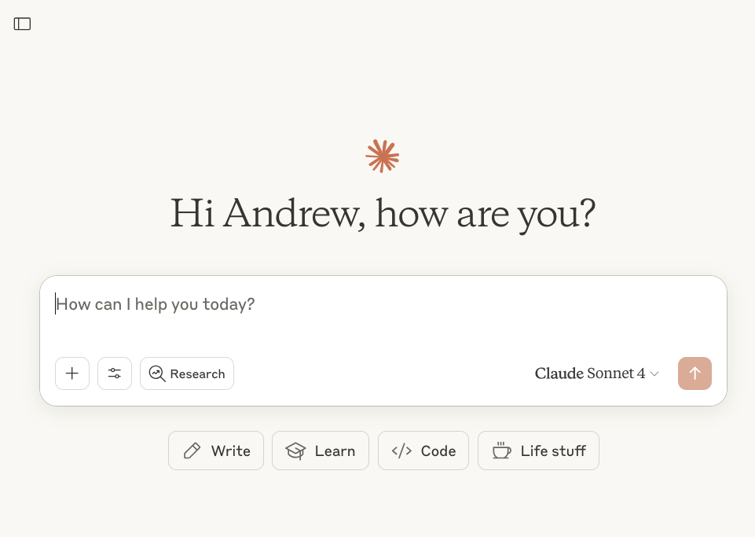
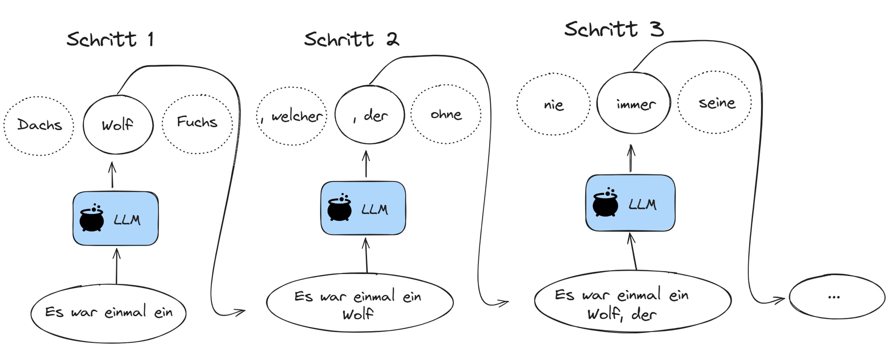
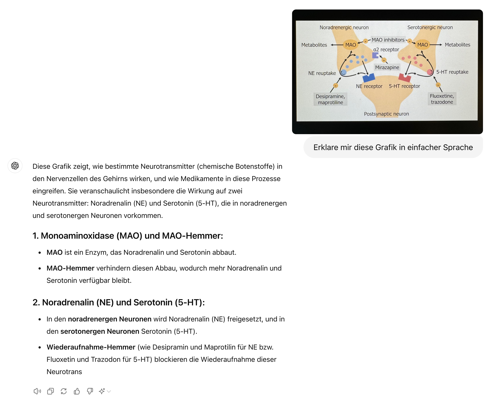
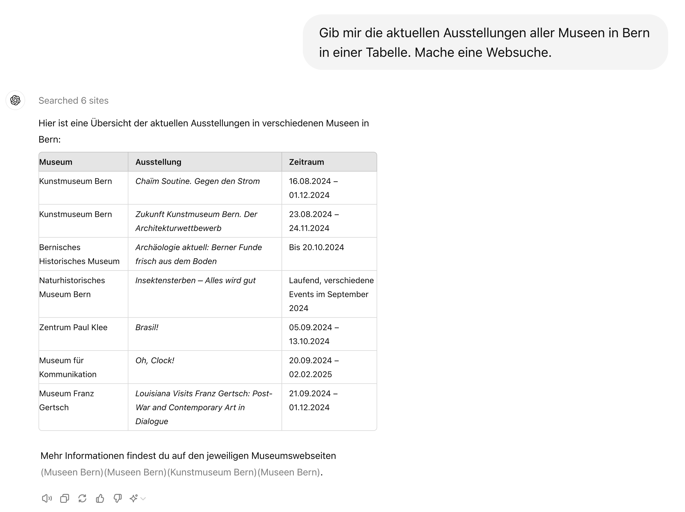
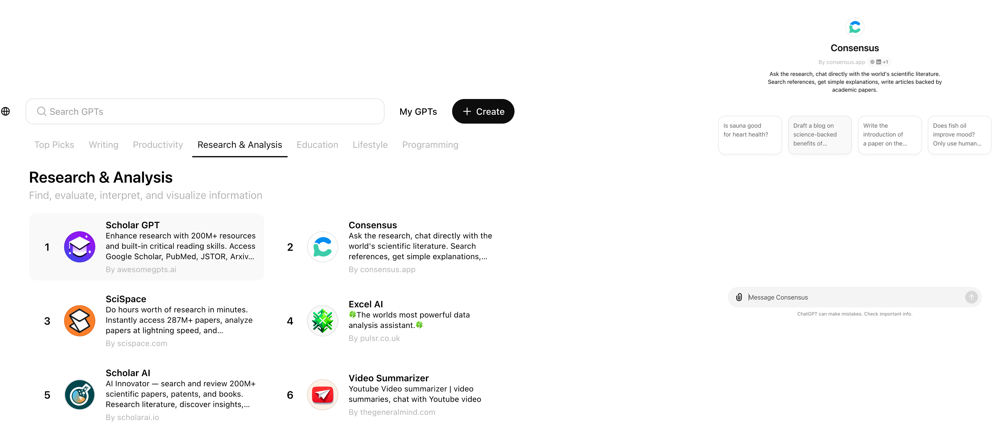

## Was sind Chatbots?

:::: {.columns}
::: {.column width="30%"}

:::

::: {.column width="70%"}

:::
::::

## Was sind LLMs?

:::: {.columns}
::: {.column width="60%"}
Ein LLM kann man sich wie einen ausgefeilten Autocomplete-Mechanismus vorstellen.
:::
::: {.column width="40%"}

:::
::::

:::{.attribution}
Bildquelle: [www.apple.com](https://www.apple.com)
:::

## Was sind LLMs?
- Statistische Modelle, die Text analysieren, um das nächste Wort vorherzusagen.

::: {.hidden}
$$
\newcommand{\green}[1]{\color{green}{#1}}
\newcommand{\purple}[1]{\color{purple}{#1}}
\newcommand{\red}[1]{\color{red}{#1}}
\newcommand{\blue}[1]{\color{blue}{#1}}
$$
:::

$$\green{P(\text{Wort}_{i+1}} \mid \red{\text{Kontext}}, \blue{\text{Modell}})$$

- Jede $\purple{\text{Vorhersage}}$ basiert auf dem $\blue{\text{Kontext}}$ und dem internen $\red{\text{Modell}}$.

## Vorhersage

Nicht alle Teile des Kontexts sind gleich wichtig:

   

<!-- :::{.callout-note appearance="minimal"}-->
:::{.r-fit-text}
_"Die Familie, die sehr wohlhabend war, lebte in einem grossen Haus. Das Haus stand inmitten eines weitläufigen Gartens. Es war bekannt für seine prächtige Fassade und die grosszügigen ___"_
::: 

:::{.attribution}
Nach Thomas Mann, *Buddenbrooks*
:::

   

Welche Wörter sind besonders wichtig, um 

- die Bedeutung des Satzes zu erfassen?
- das nächste Wort vorherzusagen?

## Kontext verstehen {.smaller}

:::{.callout-note appearance="minimal"}
"Die Familie, die sehr wohlhabend war, lebte in einem grossen Haus. Das Haus stand inmitten eines weitläufigen Gartens. Es war bekannt für seine prächtige Fassade und die grosszügigen ___"
:::

**Syntaktische Struktur (Grammatik und Struktur des Satzes):**

- Das Wort "grosszügigen" ist ein Adjektiv, das wahrscheinlich ein Nomen im Plural beschreibt (Dativ oder Akkusativ wegen der Endung "-en").
- Der Satz bezieht sich auf das Haus und den Garten, daher liegt der Fokus vermutlich auf deren Eigenschaften.

**Semantischer Kontext (Bedeutung):**

Die Beschreibung hebt Wohlstand hervor. Das nächste Wort beschreibt vermutlich etwas Luxuriöses oder Weitläufiges.

**Lexikalische Kohärenz (Wörter und deren Bedeutungen im Kontext):**

Nach "grosszügigen" folgen häufig Nomen, die Räume, Flächen oder architektonische Elemente beschreiben, z. B. "Räume", "Gärten", "Fenster".

<!-- ## Wie generieren LLMs Text?

   

 -->

## Wie generieren LLMs Text?

   

::: {.hidden}
$$
\newcommand{\green}[1]{\color{green}{#1}}
\newcommand{\purple}[1]{\color{purple}{#1}}
\newcommand{\red}[1]{\color{red}{#1}}
\newcommand{\blue}[1]{\color{blue}{#1}}
$$
:::

$$\green{P(\text{Wort}_{i+1}} \mid \red{\text{Kontext}}, \blue{\text{Modell}})$$

<!-- ## Wie können LLMs Text vorhersagen? {.smaller}

Sie werden trainiert, das nächste Wort in einer gegebenen Wortsequenz zu erraten.

:::: {.columns}
::: {.column width="50%"}
Ein LLM wird in drei Schritten aufgebaut:

1. Sammeln eines grossen Text-Korpus.
2. Basierend auf diesem Text, muss das Modell das nächste Wort in einer gegebenen Wortsequenz vorherzusagen lernen.
3. Das Sprachmodell wird feiner abgestimmt, um das gewünschte Verhalten zu erreichen.

:::
::: {.column width="50%"}

:::
:::: -->

## Wie werden LLMs trainiert?

## LLMs und menschliches Lernen

LLMs lernen statistische Muster aus Milliarden von Texten. Menschen lernen durch **aktive Auseinandersetzung** mit dem Stoff: Vorhersagen treffen, Fehler machen, Schemas aufbauen.

::: {.callout-note title="Das Evaluationsparadox" appearance="simple"}
Um KI-Outputs beurteilen zu können, braucht man genau die Fachkompetenz, die das Lernen erst entwickeln soll. LLMs liefern flüssige Texte, aber Flüssigkeit ist kein Zeichen für Verständnis.
:::

## Gefahren und Herausforderungen

:::: {.columns}
::: {.column width="50%"}
:::{.r-fit-text}
Die verschiedenen Stufen des Trainings sind mit verschiedenen Arten von Bedenken verbunden:

- **Urheberrecht**: Die trainierten Modelle werden mit Texten trainiert, die möglicherweise Urheberrechtlich geschützt sind.
- **Bias**: Die trainierten Modelle können bestehende Vorurteile aus den Trainingsdaten lernen.
- **Energieverbrauch**: Das Training der Modelle verbraucht viel Energie und ist damit umweltbelastend.
- **Sycophancy**: Die Modelle neigen dazu, die Meinungen oder Präferenzen ihrer Benutzer zu bestätigen.
:::

:::
::: {.column width="50%"}

:::
::::

## Gefahren und Herausforderungen

:::: {.columns}
::: {.column width="50%"}
:::{.r-fit-text}
- Obschon sich LLMs viel Wissen aneignen[^1], werden sie nicht trainiert, faktisch korrekte Aussagen zu machen.
- Dies bedeutet, dass wir alle Aussagen, die LLMs uns präsentieren, immer kritisch hinterfragen müssen.
- LLMs sind **keine Wissensdatenbanken**. Informationen immer anhand externer Quellen überprüfen.
:::
:::
::: {.column width="50%"}

:::
::::

[^1]: Das ganze Wissen, welches nötig ist, um Texte Wort für Wort vorherzusagen.

## ChatGPT: Die bekannteste Oberfläche

Die Chat-Oberfläche von OpenAI, die LLMs für alle zugänglich gemacht hat.

## Fragen beantworten

Direkte Wissensfragen sind die einfachste Anwendung.

## Bilder analysieren

Multimodale Modelle können auch visuellen Input verarbeiten.

## Dokumente zusammenfassen

Lange Texte in Kernaussagen destillieren.

## Output strukturieren

Antworten in Tabellen, Listen oder spezifische Formate bringen.

## Websuche

Aktuelle Informationen aus dem Internet einbeziehen.

## Datenanalyse

Code ausführen, Daten analysieren und visualisieren.

## Custom GPTs

Eigene, spezialisierte Assistenten mit vordefinierten Instruktionen erstellen.

