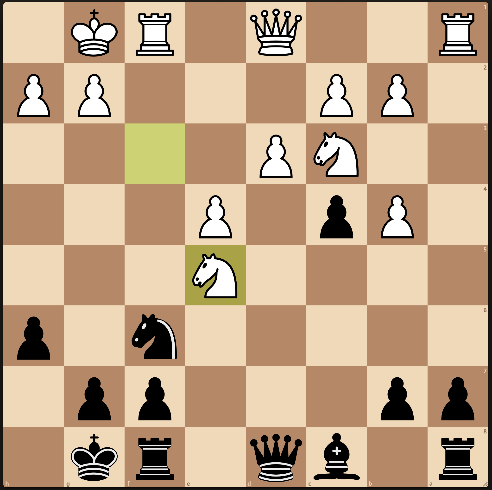

 ---
title: "Wie Menschen lernen"
subtitle: "The right kind of cognitive effort is not a bug---it's a signal that learning is happening"
---

## KI kann uns produktiver machen

**Forschung zeigt**: KI steigert Produktivität und Qualität bei kognitiven Aufgaben, aber mit Nebenwirkungen.

:::{.fragment}
- Automatisierung von routinemässigen kognitiven Aufgaben ist möglich
- Unterstützung kreativer Arbeit ist möglich
- **Deskilling**: Gefahr, bei ständiger KI-Unterstützung eigene Fähigkeiten zu verlieren
- Ohne Training: KI-Tools werden oft für ungeeignete Aufgaben eingesetzt
:::

::: aside
@dellacquaNavigatingJaggedTechnological2023; @toner-rodgersArtificialIntelligenceScientific2025; @cuiEffectsGenerativeAI2024
:::

## {.center}

Aber halt...

...

:::{.fragment}
### Sollten **Lernende** überhaupt produktiver sein?
:::

:::{.fragment}
Was ist, wenn der **kognitive Prozess** beim Lernen wichtiger ist als das **Ergebnis**?
:::

## Warum existieren Schulen?

Wir unterscheiden zwischen [@gearyEvolutionarilyInformedEducation2008; @swellerDevelopmentCognitiveLoad2023]:

::::{.columns}
:::{.column width="50%"}
**Biologisch primärem Wissen**:

- Entwickelt sich bei normaler Umgebung ohne formale Instruktion
- Beispiele: Sprechen lernen, Gesichter erkennen, soziale Interaktion
:::
:::{.column width=50%}
**Biologisch sekundärem Wissen**:

- Kulturelle Errungenschaften ohne evolutionäre Anpassung
- Erfordert bewusste Anstrengung und Instruktion
- Beispiele: Lesen, Schreiben, Mathematik, Programmieren
:::
::::

:::{.fragment}
::: {.callout-important}
Akademische Fähigkeiten erfordern explizite Anleitung und strukturiertes Üben. Sie entstehen nicht durch Entdeckung allein [@kirschnerWhyMinimalGuidance2006].
:::
:::

## Experten vs. Anfänger

:::: {.columns}

::: {.column width="50%"}
::: {.callout-important}
Experten haben **besser organisierte Wissensstrukturen (Schemata)**, die Anfänger erst aufbauen müssen. Die kognitive Architektur (Arbeitsgedächtnis, Langzeitgedächtnis) ist bei allen Menschen gleich.
:::
:::

::: {.column width="50%"}
{width=30% fig-align="center"}
:::

::::

**Gleiche Hardware, unterschiedliche Software**

| Dimension       | **Anfänger**                                                              | **Experten**                                                 |
| --------------- | ------------------------------------------------------------------------------- | ---------------------------------------------------------------- |
| **Sehen**       | Einzelne Teile                                                                | Bedeutungsvolle Muster                                |
| **Verarbeiten** | Schritt-für-Schritt, deliberativ, bewusst | Automatische Prozeduren, intuitiv |
| **Wissen**      | Isolierte Fakten, Bahnen im Aufbau                                 | Vernetzte Schemata, tausende Stunden geübt        |

## Cognitive Load Theory

**Warum Anfänger anders lernen müssen als Experten** [@swellerDevelopmentCognitiveLoad2023]

::::{.columns}
:::{.column width="50%"}
### Arbeitsgedächtnis

- **Begrenzt**: ~4 Elemente gleichzeitig
- **Flüchtig**: Sekunden ohne Wiederholung
- **Nadelöhr**: Bewusste Verarbeitung findet hier statt
:::

:::{.column width="50%"}
### Langzeitgedächtnis

- **Unbegrenzt**: Keine bekannte Obergrenze
- **Dauerhaft**: Jahre bis lebenslang
- **Organisiert**: Schemata und automatisierte Prozesse
:::
::::

:::{.fragment}
::: {.callout-tip}
**Kernprinzip**: Lernen erfordert Transfer vom Arbeits- ins Langzeitgedächtnis durch Schemabildung
:::
:::

## Zwei Quellen kognitiver Belastung

::::{.columns}
:::{.column width="50%"}
**Intrinsisch**

Komplexität des Lernstoffs selbst (Elementinteraktivität)

*Begrenzt steuerbar (Sequenzierung)*
:::

:::{.column width="50%"}
:::{.fragment}
**Extrinsisch**

Wie Material präsentiert wird

*Durch Design **minimierbar***
:::
:::
::::

:::{.fragment}
::: {.callout-tip}
**Das Ziel:** Raum schaffen für *germane processing*, die lernrelevante Verarbeitung, die Schemas aufbaut. Das ist kein dritter Belastungstyp, sondern der produktive Anteil der intrinsischen Verarbeitung.
:::
:::

## Das Lerndilemma

Die Gesamtlast darf das Arbeitsgedächtnis nicht überfordern.

:::{.fragment}
Aber: Lernrelevante Verarbeitung (*germane processing*) ist **essentiell** für Expertise-Entwicklung.
:::

:::{.fragment}
::: {.callout-warning}
**Lösung**: Extrinsische Last minimieren, um Raum für lernrelevante Verarbeitung zu schaffen.
:::
:::

## Der Expertise Reversal Effect

**Was Anfängern hilft, schadet Experten, und umgekehrt** [@kalyugaExpertiseReversalEffect2009]

| Prinzip | Für Anfänger | Für Fortgeschrittene |
|---------|--------------|----------------------|
| **Worked Examples** | Reduziert kognitive Last | Redundante Information erzeugt extrinsische Last |
| **Problem Solving** | Überfordert Arbeitsgedächtnis | Verfeinert und vernetzt bestehende Schemata |

:::{.fragment}
::: {.callout-important}
**Praktische Regel**: Beginne mit hoher Unterstützung (Scaffolding) und reduziere sie graduell mit wachsender Expertise.

**Die KI-Falle**: KI-Tools bieten permanentes Scaffolding, das nie abgebaut wird. Sie verletzen das Fading-Prinzip systematisch.
:::
:::

## CLT und KI: Was passiert bei Outsourcing?

**KI optimiert für Produktion statt Lernen**

| Kognitive Last | Ohne KI | Mit KI (Outsourcing) |
|--------|---------|--------|
| **Intrinsisch** | Bleibt konstant | Lernende begegnen der Komplexität nicht |
| **Extrinsisch** | Variabel | Minimiert |
| **Lernrelevante Verarbeitung** | Wird aufgebracht | **Eliminiert** |

::: {.fragment}
Die Komplexität des Materials bleibt gleich, aber die Studierenden begegnen ihr nie.
:::

## CLT und KI: Die Nuance

::: {.callout-note}
Lernrelevante Verarbeitung wird nur eliminiert, wenn KI die Denkarbeit **übernimmt** (Outsourcing).
:::

:::{.fragment}
Wenn KI *nach eigenem Versuch* als Feedback-Werkzeug dient (Offloading), kann die lernrelevante Verarbeitung **erhalten bleiben**.
:::

:::{.fragment}
Die Reihenfolge entscheidet: **Versuch → dann → KI-Feedback**
:::

## Warum Outsourcing Schemabildung verhindert

Schemabildung erfordert **aktive Verarbeitung** interagierender Elemente im Arbeitsgedächtnis. Outsourcing eliminiert diese Verarbeitung.

:::{.fragment}
Das zeigt sich in drei Mechanismen:

1. **Fehlende Modellaktivierung**: Ohne eigenen Versuch wird das interne Wissensmodell nicht aktiviert, und Feedback bleibt uninformativ
2. **Konsolidierung**: Ohne aktive Verarbeitung keine Speicherung im Langzeitgedächtnis
3. **Prozedurale Entwicklung**: Ohne Übungszyklen keine Automatisierung
:::

:::{.fragment}
::: {.callout-warning}
Die kognitive Verarbeitung, die sich als Schwierigkeit anfühlt (Schemabildung, Abruf, Elaboration), ist kein Bug, sondern das zentrale Feature für Expertise-Entwicklung.
:::
:::

## Wie Expertise entwickelt wird

**Von Fakten zu automatisierten Prozeduren** [@andersonAcquisitionCognitiveSkill1982]

| Gedächtnissystem | Beschreibung | Beispiel |
| ---------------- | ------------ | -------- |
| **Deklarativ** ("Wissen dass") | Fakten, Regeln; bewusster Abruf | "Um $3x + 5 = 20$ zu lösen, $5$ von beiden Seiten subtrahieren." |
| **Prozedural** ("Wissen wie") | Automatisiert; schnelle Ausführung | $3x + 5 = 20$ sehen → automatisch umstellen, ohne bewusst über die Schritte nachzudenken |

:::{.fragment}

### Der Weg zur Expertise

**Deklarative Fakten** → Tausende Übungszyklen mit Feedback → **Prozedurale Automatismen**

Jeder Zyklus: Versuch → Ergebnis → Anpassung → stärkere Produktionsregeln
:::

## Das Lernparadox (1/2)

### Beim **Kämpfen** mit einem Problem

::::{.columns}
:::{.column width="50%"}
**Wie es sich anfühlt:**

- Frustration
- "Ich kann das nicht"
- Langsamer Fortschritt
- Unsicherheit
:::

:::{.column width="50%"}
:::{.fragment}
**Was tatsächlich passiert (bei angemessener Herausforderung):**

- Tiefes Verständnis bildet sich
- Schemata werden aufgebaut
- Langzeitgedächtnis wird aktiviert
- **Echtes Lernen**
:::
:::
::::

:::{.fragment}
::: {.callout-note}
**Der Trugschluss**: "Wenn es schwer ist, lerne ich nicht"
:::
:::

## Das Lernparadox (2/2)

### Beim **Produzieren** mit KI-Hilfe

::::{.columns}
:::{.column width="50%"}
**Wie es sich anfühlt:**

- Erfolgsgefühl
- "Ich bin produktiv"
- Schnelle Ergebnisse
- Selbstvertrauen
:::

:::{.column width="50%"}
:::{.fragment}
**Was tatsächlich passiert:**

- Oberflächliche Verarbeitung
- Keine Schemabildung
- Arbeitsgedächtnis kaum aktiv
- **Illusion des Lernens**
:::
:::
::::

:::{.fragment}
::: {.callout-warning}
**Der Trugschluss**: "Wenn ich etwas produziere, lerne ich"
:::
:::

## Die gefährliche Umkehrung {.center}

 

**Unser metakognitives Urteil führt uns systematisch in die Irre:**

Wir verwechseln Verarbeitungsflüssigkeit (wie leicht sich etwas anfühlt) mit Lernerfolg. Was sich mühelos anfühlt, fühlt sich wie Lernen an, ist es aber oft nicht.

. . .

 

Produktive Anstrengung **fühlt sich schwierig an**. Unter den richtigen Bedingungen (angemessene Herausforderung, Feedback, Scaffolding) **signalisiert diese Schwierigkeit, dass lernrelevante Prozesse aktiv sind**: Schemabildung, Abruf, Elaboration.

. . .

 

**Merksatz:** "The right kind of cognitive effort is not a bug---it's a signal that learning is happening."

## Bibliographie

::: {#refs}
:::
