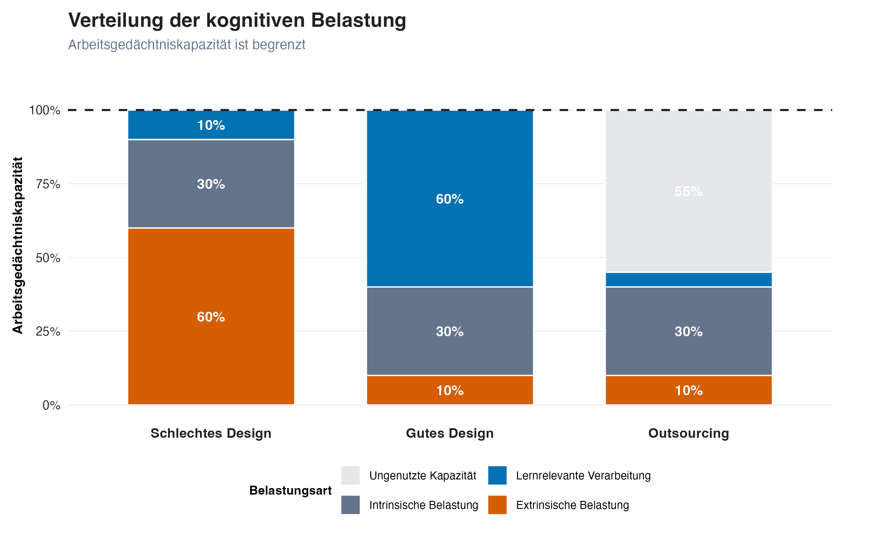
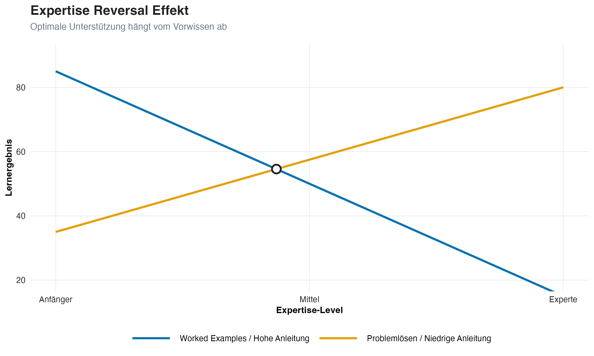
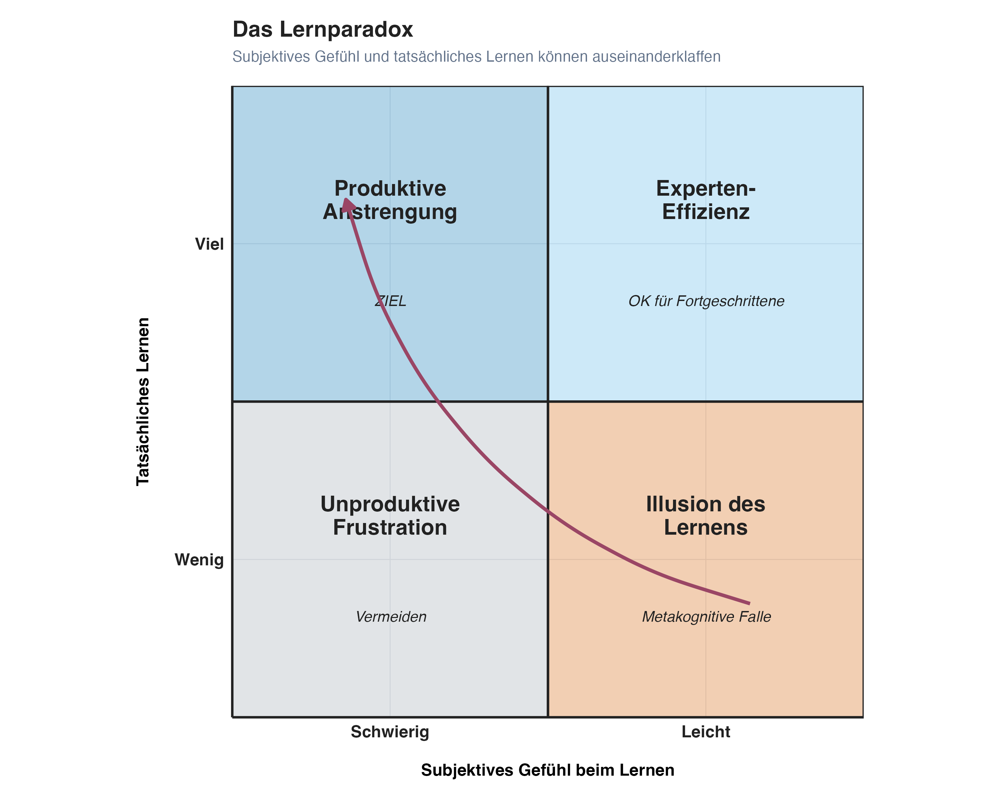

## KI steigert Produktivität

KI verbessert Leistung bei kognitiven Aufgaben

- Routineaufgaben werden schneller erledigt
- Kreative Arbeit wird unterstützt
- Qualität steigt (bei Expert:innen)

::: aside
@dellacquaNavigatingJaggedTechnological2023; @toner-rodgersArtificialIntelligenceScientific2025
:::

## Aber es gibt Nebenwirkungen

:::{.fragment}
**Deskilling**: Eigene Fähigkeiten verkümmern bei dauerhafter KI-Nutzung
:::

:::{.fragment}
Ohne Training setzen Menschen KI für ungeeignete Aufgaben ein
:::

::: aside
@cuiEffectsGenerativeAI2024
:::

## {.center}

:::{.fragment}
### Sollten **Lernende** überhaupt produktiver sein?
:::

:::{.fragment}
Was ist, wenn der **kognitive Prozess** beim Lernen wichtiger ist als das **Ergebnis**?
:::

## Warum existieren Schulen?

Wir unterscheiden zwischen [@gearyEvolutionarilyInformedEducation2008; @swellerDevelopmentCognitiveLoad2023]:

::::{.columns}
:::{.column width="50%"}
###  Biologisch primär

- Entwickelt sich natürlich
- Keine formale Instruktion nötig

**Beispiele:** Sprechen, Gesichtserkennung, soziale Interaktion
:::
:::{.column width="50%"}
###  Biologisch sekundär

- Kulturelle Errungenschaften
- Erfordert bewusste Anstrengung

**Beispiele:** Lesen, Schreiben, Mathematik, Programmieren
:::
::::

:::{.fragment}
::: {.callout-important}
Akademische Fähigkeiten profitieren typischerweise stark von expliziter Anleitung und strukturiertem Üben [@kirschnerWhyMinimalGuidance2006]. Wie viel Anleitung optimal ist, hängt vom Expertise-Niveau ab (→ Expertise Reversal Effect).
:::
:::

<!-- ## Biologisch primär vs. sekundär

 -->

## Experten vs. Anfänger
<!-- #TODO: we haven't introduced the concept of working memory yet -->
:::: {.columns}

::: {.column width="50%"}
::: {.callout-important}
Experten haben **besser organisierte Wissensstrukturen (Schemata)**, die Anfänger erst aufbauen müssen. Die kognitive Architektur (Arbeitsgedächtnis, Langzeitgedächtnis) ist bei allen Menschen gleich [@swellerDevelopmentCognitiveLoad2023].
:::
:::

::: {.column width="50%"}
{width=30% fig-align="center"}
:::

::::

## Gleiche Hardware, unterschiedliche Software {.smaller}

| Dimension       | **Anfänger**              | **Experten**                        |
| --------------- | ------------------------- | ----------------------------------- |
| **Sehen**       | Einzelne Teile            | Bedeutungsvolle Muster              |
| **Verarbeiten** | Schritt-für-Schritt       | Automatische Prozeduren             |
| **Wissen**      | Isolierte Fakten          | Vernetzte Schemata                  |

<!-- Here I need an example for step-by -step processing, weak methods,
means-end analysis, etc -->

## Gleiche Hardware, unterschiedliche Software


<!-- Der Weg von links nach rechts *ist Lernen* -->

## Was organisierte Schemata ermöglichen {.center}

Gut vernetzte Schemata ermöglichen **Transfer**: Wissen auf neue, unbekannte Situationen anwenden.

:::{.fragment}
Anfänger sehen **Oberflächenmerkmale**. Experten erkennen die **Tiefenstruktur** und können Wissen auf neue Probleme übertragen.
:::

:::{.fragment}
::: {.callout-tip}
**Transfer ist das eigentliche Ziel von Hochschulbildung.** Wir unterrichten nicht, damit Studierende bekannte Aufgaben lösen. Wir unterrichten, damit sie mit *unbekannten* Situationen umgehen können.
:::
:::

## Das Nadelöhr des Lernens {.smaller}

**Cognitive Load Theory** [@swellerDevelopmentCognitiveLoad2023]



::: {.callout-tip}
**Kernprinzip**: Lernen erfordert Transfer vom Arbeits- ins Langzeitgedächtnis durch Schemabildung.
:::

<!-- This figure needs explaining -->

## Zwei Quellen kognitiver Belastung

::::{.columns}
:::{.column width="50%"}
**Intrinsisch**

Komplexität des Lernstoffs selbst (Elementinteraktivität)
<!-- Wie viele Elemente müssen gleichzeitig in Beziehung zueinander verarbeitet werden -->
*Begrenzt steuerbar (z.B. durch Sequenzierung)*
:::

:::{.column width="50%"}
**Extrinsisch**
<!-- Schlechtes Design, Ablenkung, unnötige Komplexität -->
Wie Material präsentiert wird

*Durch Design **minimierbar***
:::
::::

<!-- Das Ziel ist, Raum zu schaffen für *germane processing*, also für die
lernrelevante Verarbeitung, die Schemata aufbaut -->

:::{.fragment}
::: {.callout-tip}
**Das Ziel:** Raum schaffen für *germane processing*, die lernrelevante Verarbeitung, die Schemata aufbaut.
:::
:::

## Verteilung der kognitiven Belastung



## Das Lerndilemma

::::{.columns}
:::{.column width="50%"}
Die Gesamtlast darf das Arbeitsgedächtnis nicht überfordern.

:::{.fragment}
Aber: Lernrelevante Verarbeitung (*germane processing*) ist **essentiell** für Expertise-Entwicklung.
:::

:::

:::{.column width="50%"}

:::
::::
:::{.fragment}
::: {.callout-warning}
**Lösung**: Extrinsische Last minimieren, um Raum für lernrelevante Verarbeitung zu schaffen.
:::
:::

## Schwierig ≠ Komplex {.smaller}
<!-- Here we use the terms offloading and outsourcing, but these haven't been
properly introduced yet -->
Nicht jede schwierige Aufgabe ist komplex [@chenCognitiveLoadTheory2023]

| | **Schwierig, nicht komplex** | **Komplex** |
|---|---|---|
| **Elementinteraktivität** | Niedrig | Hoch |
| **Was passiert** | Viele Elemente, die *unabhängig* gelernt werden | Wenige Elemente, die *alle gleichzeitig* verarbeitet werden müssen |
| **Beispiel** | Fachvokabular, Periodensystem, Quellenformate | Argumentation aufbauen, Gleichung lösen, Fall analysieren |
| **KI-Empfehlung** | Offloading möglich | Outsourcing verhindern |

:::{.fragment}
::: {.callout-important}
**Die Konsequenz:** Schütze die *komplexen* Aufgabenanteile (hohe Elementinteraktivität) vor KI-Outsourcing. Die *schwierigen* Routineanteile (niedrige Elementinteraktivität) können delegiert werden.
:::
:::
<!-- We need an example here -->

## Der Expertise Reversal Effect {.smaller}

**Was Anfängern hilft, schadet Experten, und umgekehrt** [@kalyugaExpertiseReversalEffect2009]

::::{.columns}
:::{.column width="50%"}
| Prinzip | Für Anfänger | Für Fortgeschrittene |
|---------|--------------|----------------------|
| **Worked Examples** | Reduziert kognitive Last | Redundante Information erzeugt extrinsische Last |
| **Problem Solving** | Überfordert Arbeitsgedächtnis | Verfeinert und vernetzt bestehende Schemata |

:::

:::{.column width="50%"}

:::
::::

:::{.fragment}
::: {.callout-important}
**Praktische Regel**: Beginne mit hoher Unterstützung und reduziere sie graduell mit wachsender Expertise (Fading).
:::
:::

## Wie Expertise entwickelt wird {.smaller}

**Von Fakten zu automatisierten Prozeduren** [@andersonAcquisitionCognitiveSkill1982]

| Gedächtnissystem | Beschreibung | Beispiel |
| ---------------- | ------------ | -------- |
| **Deklarativ** ("Wissen dass") | Fakten, Regeln; bewusster Abruf | $x + 5 = 12$ → Regel abrufen: "5 von beiden Seiten subtrahieren" → $x = 7$ |
| **Prozedural** ("Wissen wie") | Automatisiert; schnelle Ausführung | $x + 5 = 12$ → sofort sehen: $x = 7$ |

:::{.fragment}
### Der Weg zur Expertise

**Deklarativ** → Übungszyklen mit Feedback → **Prozedural**
:::

<!-- ## Der Weg zur Expertise

 -->

## Warum Abrufpraxis funktioniert {.smaller}

Abruf (Retrieval) ist eine der wirksamsten Formen dieser Übungszyklen, denn Abruf misst nicht nur Lernen, er *erzeugt* Lernen [@roedigerCriticalRoleRetrieval2011]

 

| Mechanismus | Wirkung |
|-------------|---------|
| **Stärkt Abrufrouten** | Jeder erfolgreiche Abruf macht die Erinnerung zugänglicher |
| **Identifiziert Lücken** | Scheitern beim Abruf zeigt, was man nicht weiss |
| **Fördert Elaboration** | Rekonstruktion aktiviert verwandtes Wissen |
| **Aktualisiert Kontext** | Neue Abrufkontexte machen Wissen transferierbarer |

:::{.fragment}
::: {.callout-important}
**Deshalb funktionieren die Gedächtnis-Aktivierungen im Workshop**: Nicht die Anstrengung selbst, sondern die durch den Abruf ausgelösten Prozesse festigen das Gelernte.
:::
:::

## Drei verbreitete Missverständnisse {.center}

:::{.fragment}
"Wenn es **schwer** ist, lerne ich nicht."
:::

:::{.fragment}
"Wenn ich etwas **produziere**, lerne ich."
:::

:::{.fragment}
"KI macht mich **produktiver**, also lerne ich **mehr**."
:::

## Das Lernparadox (1/2)

### Beim **Kämpfen** mit einem Problem

::::{.columns}
:::{.column width="50%"}
**Wie es sich anfühlt:**

- Frustration
- "Ich kann das nicht"
- Langsamer Fortschritt
- Unsicherheit
:::

:::{.column width="50%"}
:::{.fragment}
**Was tatsächlich passiert (bei angemessener Herausforderung):**

- Tiefes Verständnis bildet sich
- Schemata werden aufgebaut
- Langzeitgedächtnis wird aktiviert
- **Echtes Lernen**
:::
:::
::::

:::{.fragment}
::: {.callout-note}
**Der Trugschluss**: "Wenn es schwer ist, lerne ich nicht"
:::
:::

## Das Lernparadox (2/2)

### Beim **Produzieren** mit KI-Hilfe

::::{.columns}
:::{.column width="50%"}
**Wie es sich anfühlt:**

- Erfolgsgefühl
- "Ich bin produktiv"
- Schnelle Ergebnisse
- Selbstvertrauen
:::

:::{.column width="50%"}
:::{.fragment}
**Was tatsächlich passiert:**

- Oberflächliche Verarbeitung
- Keine Schemabildung
- Arbeitsgedächtnis kaum aktiv
- **Illusion des Lernens**
:::
:::
::::

:::{.fragment}
::: {.callout-warning}
**Der Trugschluss**: "Wenn ich etwas produziere, lerne ich"
:::
:::

## Das Lernparadox: Die Übersicht {.smaller}

::::{.columns}
:::{.column width="50%"}

:::

:::{.column width="50%"}
Wir verwechseln **Verarbeitungsflüssigkeit** (wie leicht sich etwas anfühlt) mit **Lernerfolg** [@bjorkMemoryMetamemoryConsiderations1994].

:::{.fragment}
Produktive Anstrengung **fühlt sich schwierig an**, signalisiert aber, dass lernrelevante Prozesse aktiv sind.
:::

:::{.fragment}
Wenn es sich anstrengend anfühlt, ist das meistens ein gutes Zeichen.
:::
:::
::::

## Was wir jetzt wissen {.center}

Lernen = **Schemabildung** im Langzeitgedächtnis

Erfordert **aktive kognitive Verarbeitung**

Fühlt sich **anstrengend** an (metakognitive Falle)

Ziel: **Transfer**, also Wissen auf neue Situationen anwenden können

:::{.fragment}
### Jetzt die Frage: Was macht KI mit diesen Prozessen?
:::

## Bibliographie

::: {#refs}
:::
