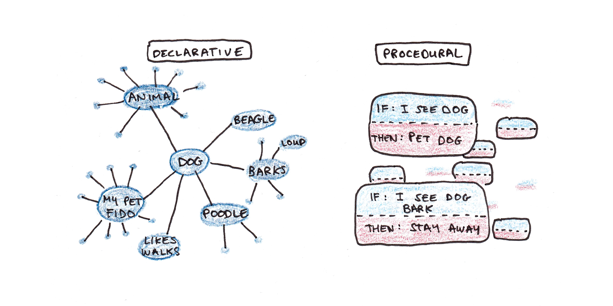

 ---
title: "Wie Menschen lernen"
subtitle: "Cognitive effort isn't a bug---it’s the feature"
---

## KI kann uns produktiver machen {.smaller}

- **Wichtige Erkenntnisse aus der Forschung**:
  - @dellacquaNavigatingJaggedTechnological2023 erforschen die Möglichkeiten, mit KI-Unterstützung kognitive Aufgaben zu verbessern. Fazit: KI kann Produktivität und Qualität steigern, aber auch neue Herausforderungen ergeben.
  - @toner-rodgersArtificialIntelligenceScientific2025 diskutiert die Implikationen von KI für die Forschung und betont die Balance zwischen menschlicher und maschineller Intelligenz.
  - @cuiEffectsGenerativeAI2024 analysieren die Auswirkungen von generativer KI auf Software Engineering und hebt sowohl Chancen als auch Herausforderungen hervor.

- **Erkenntnisse**:
  - Automatisierung von routinemässigen kognitiven Aufgaben ist möglich
  - Unterstützung kreativer Arbeit ist möglich
  - Deskilling: Gefahr, bei ständiger KI-Unterstützung eigene Fähigkeiten zu verlieren
  - Ohne Training: KI-Tools werden oft für ungeeignete Aufgaben eingesetzt

## {.center}

Aber halt...

🤔

:::{.fragment}
### Sollten **Lernende** überhaupt produktiver sein?
:::

:::{.fragment}
Was ist, wenn **Anstrengung** beim Lernen wichtig ist als das **Ergebnis**?
:::

## Experten vs. Anfänger {.smaller}

**Zwei verschiedene Betriebssysteme**

| Dimension       | 🗺️ **Anfänger**                                                              | 🎯 **Experten**                                                 |
| --------------- | ------------------------------------------------------------------------------- | ---------------------------------------------------------------- |
| **Sehen**       | • Einzelne Teile                                                                | • Bedeutungsvolle Muster (Chunks)                                |
| **Verarbeiten** | • Schritt-für-Schritt-Denken • Deliberativ • Bewusste Anstrengung | • Automatische Prozeduren • Intuitiv • Unbewusst |
| **Gedächtnis**  | • separate Fakten • Deklarativ ("Ich weiss dass")                            | • bedeutungsvolle Chunks • Prozedural ("Ich weiss wie")       |
| **Neural**      | • Schwache Verbindungen • Bahnen noch im Aufbau                                 | • Myelinisierte neuronale Bahnen • Viele Stunden geübt        |
|                 |                                                                  |                                                                                 |

::: {.callout-important}
Experten haben eine neuronale Architektur, die Anfänger erst entwickeln müssen
:::

## Warum existieren Schulen?

Wir unterscheiden zwischen:

::::{.columns}
:::{.column width="50%"}
**Biologisch primärem Wissen**: 

- Wofür wir evolutionär angepasst sind
- Lernen geschieht mühelos und automatisch
- Beispiele: Sprechen lernen, Gesichter erkennen, soziale Interaktion
:::
:::{.column width=50%}
**Biologisch sekundärem Wissen**:

- Kulturelle Errungenschaften ohne evolutionäre Anpassung
- Erfordert bewusste Anstrengung und Instruktion
- Beispiele: Lesen, Schreiben, Mathematik, Programmieren
:::
::::

::: {.callout-important}
Primäres Wissen kann durch natürliche Entdeckung (discovery) erlernt werden, während akademische Fähigkeiten explizite Anleitung und strukturiertes Üben erfordern.
:::

## Wie Expertise entwickelt wird {.smaller}

| Gedächtnissystem                | Beschreibung        | Eigenschaften                                                       | Beispiel                                                |
| -------------------------- | ------------------ | --------------------------------------------------------------------- | ------------------------------------------------------ |
| **Declaratives Gedächtnis** | **"Wissen dass"** | • Fakten, Regeln  • Bewusst, langsamer und angstender Abruf | "Um $3x + 5 = 20$ zu lösen, $5$ von beiden Seiten subtrahieren." |
| **Prozedurales Gedächtnis**   | **"Wissen wie"**  | • Automatisierte "atomische" Gedankenschritte • Schnelle, mühelose Ausführung  | $3x + 5 = 20$ sehen → direkt wissen, dass $x = 5$.               |

 

 Fakten → Tausende Übungszyklen → Automatische Prozeduren → Expertise

 

:::: {.columns}
::: {.column width="40%"}

**Warum Anstrengung wichtig ist**: Üben (wird oft als **angstengend** empfunden) stärkt die neuronalen Bahnen, welche Expertise erzeugen
:::

::: {.column width="60%"}

:::
::::

::: {.attribution}
Abbildung von [Scott H Young](https://www.scotthyoung.com/blog/2022/02/15/act-r/)
:::

## Das Lernparadox: Gefühl ≠ Realität {.smaller}

| Situation | **Wie es sich anfühlt** |  **Was tatsächlich passiert** | **Der Trugschluss** |
|-----------|---------------------------|--------------------------------|----------------------|
| **Beim Kämpfen mit einem Problem** | • **Frustration** 😣  • "Ich kann das nicht" • Langsamer Fortschritt • Unsicherheit | • Neue neuronale Verbindungen entstehen • Tiefes Verständnis bildet sich • Langzeitgedächtnis wird aktiviert • **Echtes Lernen** 🧠 | "Wenn es schwer ist, lerne ich nicht" ❌  |
| **Beim Produzieren mit KI-Hilfe** | • **Erfolgsgefühl** 😊  • "Ich bin produktiv" • Schnelle Ergebnisse • Selbstvertrauen | • Oberflächliche Verarbeitung • Keine neuen Verbindungen • Arbeitsgedächtnis nur kurz aktiv • **Illusion des Lernens** 🃏| "Wenn ich etwas produziere, lerne ich" ❌  |

. . .

:::{.callout-warning}
## Die gefährliche Umkehrung
**Unser Gehirn belügt uns:** Was sich wie Lernen anfühlt (mühelose Produktion) ist oft das Gegenteil von Lernen.

**Die Wahrheit:** Echter Lernfortschritt fühlt sich wie Scheitern an.
:::

. . .

**Merksatz:** "Cognitive effort isn't a bug---it’s the feature."

## Das Problem der kognitiven Auslagerung {.smaller}

Drei Wege, wie Lernen gestört wird:

| Problem | Mechanismus | Konsequenz der Auslagerung an KI |
|---------|-------------|-----------------------------------|
| **Keine Vorhersagefehler** | Gehirn lernt aus Lücken zwischen "was ich erwarte" und "was passiert" | Eliminiert dies vollständig |
| **Keine Gedächtnisbildung** | Information, die nicht aktiv verarbeitet wird, wird nicht gespeichert | Liefert Antworten ohne Verarbeitung |
| **Keine prozedurale Entwicklung** | Expertise erfordert tausende "atomare Denkschritte" | Überspringt diesen Aufbauprozess |

   

::: {.callout-warning}
**Ergebnis**: Die Auslagerung kognitiver Prozesse (*cognitive offloading*) kann zu oberflächlicher Verarbeitung ohne tiefes Verständnis und Abhängigkeit von Tools führen.
:::

## Das LERN-Protokoll {.smaller}

| | 🎯 Aktion | ⚡ Warum | 🚫 Nicht |
|---|-----------|----------|----------|
| **L**ass Schwierigkeit zu | Verwirrung aushalten | Anstrengung = neuronale Bahnen | Lösungen nachschlagen |
| **E**rlaube Fehler | Erst raten, dann prüfen | Vorhersagefehler = Lernsignal | Fehler vermeiden |
| **R**ufe aktiv ab | Ohne Notizen erklären | Generierung > Erkennung | Passiv lesen |
| **N**utze Abstände | Nach Tagen wiederholen | Vergessen + Neulernen = Behalten | Massiert üben |

:::{.callout-tip}
## Die 85%-Regel
Ziel: ~85% Erfolg (nicht 95%+ oder <70%)
:::

> **Jeder leichte Weg = eine verpasste Lernchance**

::: {.attribution}
Von [Claude](https://www.claude.ai) generiert.
:::

## Bibliographie

::: {#refs}
:::
